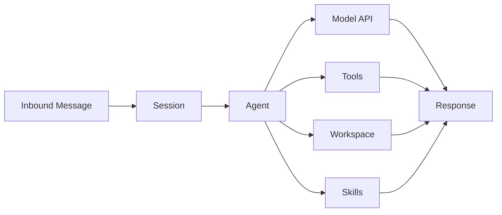

# Agents

Agents are AI model runtimes that process messages from channels and generate responses. OpenClaw uses the **Pi agent** runtime with support for multiple models, tool streaming, and workspace isolation.

## What is an Agent?

An agent is an AI assistant configured with:
- **Model**: Which AI model to use (Claude, GPT, etc.)
- **Workspace**: Local directory for files and skills
- **Tools**: Available capabilities (bash, browser, canvas, etc.)
- **Skills**: Specialized knowledge modules
- **Sandbox**: Security isolation settings



## Pi Agent Runtime

OpenClaw uses the **Pi agent** runtime from [pi-mono](https://github.com/badlogic/pi-mono).

**Features**:
- **RPC Mode**: Communicates with Gateway via JSON-RPC
- **Tool Streaming**: Real-time tool execution updates
- **Block Streaming**: Incremental response delivery
- **Extended Thinking**: Multi-step reasoning (GPT-5.2, Codex)
- **Model Fallbacks**: Automatic failover to backup models

**Location**: @mariozechner/pi-agent-core, src/agents/

### Agent Process

The agent runs as a subprocess:

```bash
# Gateway spawns agent process
node dist/agents/agent-rpc.js
```

Communication via stdin/stdout:
```json
// Gateway -> Agent
{
  "jsonrpc": "2.0",
  "id": 1,
  "method": "assistant.message",
  "params": {
    "messages": [{"role": "user", "content": "Hello"}],
    "model": "anthropic/claude-opus-4-6",
    "tools": [...]
  }
}

// Agent -> Gateway
{
  "jsonrpc": "2.0",
  "id": 1,
  "result": {
    "text": "Hi! How can I help you?",
    "usage": { "inputTokens": 50, "outputTokens": 10 }
  }
}
```

**Location**: src/agents/rpc.ts, src/acp/

## Agent Configuration

### Default Agent

The simplest configuration uses a single default agent:

```json
{
  "agent": {
    "model": "anthropic/claude-opus-4-6"
  }
}
```

This creates an agent with ID `main` using default settings.

### Agent Defaults

Configure defaults for all agents:

```json
{
  "agents": {
    "defaults": {
      "model": "anthropic/claude-opus-4-6",
      "workspace": "~/.openclaw/workspace",
      "thinkingLevel": "medium",
      "sandbox": {
        "mode": "non-main",
        "scope": "session"
      },
      "tools": {
        "allow": ["bash", "read", "write", "edit"],
        "deny": ["browser"]
      }
    }
  }
}
```

**Location**: src/config/types.agents.ts:68

### Multiple Agents

Define specialized agents for different channels or purposes:

```json
{
  "agents": {
    "defaults": {
      "model": "anthropic/claude-opus-4-6"
    },
    "list": [
      {
        "id": "main",
        "default": true,
        "workspace": "~/.openclaw/workspace"
      },
      {
        "id": "coding",
        "model": "anthropic/claude-opus-4-6",
        "workspace": "~/.openclaw/workspaces/coding",
        "skills": ["git", "bash", "python"],
        "tools": {
          "allow": ["bash", "read", "write", "edit", "browser"]
        }
      },
      {
        "id": "research",
        "model": "openai/gpt-5-turbo",
        "workspace": "~/.openclaw/workspaces/research",
        "skills": ["browser", "search"],
        "tools": {
          "allow": ["browser", "read", "write"]
        }
      }
    ]
  }
}
```

**Location**: src/config/types.agents.ts:21

## Model Configuration

### Supported Providers

- **Anthropic**: `anthropic/claude-opus-4-6`, `anthropic/claude-sonnet-4`
- **OpenAI**: `openai/gpt-5-turbo`, `openai/gpt-5-2`, `openai/codex-mini`
- **Google**: `google/gemini-pro`, `google/gemini-ultra`
- **Local**: `ollama/llama3`, `llamacpp/model-name`

### Model with Fallbacks

```json
{
  "agent": {
    "model": {
      "primary": "anthropic/claude-opus-4-6",
      "fallbacks": [
        "anthropic/claude-sonnet-4",
        "openai/gpt-5-turbo"
      ]
    }
  }
}
```

The agent automatically falls back if:
- Primary model is unavailable
- Rate limits are hit
- API errors occur

**Location**: src/agents/auth-health.ts:14, src/config/types.agents.ts:12

### Per-Session Model Override

Users can override the model per session:

```bash
# Via CLI
oclaw agent --message "Hello" --model "openai/gpt-5-turbo"

# Via chat command
/model openai/gpt-5-turbo
```

## Workspace

Each agent has a workspace directory containing:

```
~/.openclaw/workspace/
├── AGENTS.md          # System prompt
├── SOUL.md            # Personality/identity
├── TOOLS.md           # Tool instructions
└── skills/            # Skill modules
    ├── git/
    │   └── SKILL.md
    ├── python/
    │   └── SKILL.md
    └── browser/
        └── SKILL.md
```

### AGENTS.md

Defines the agent's behavior and capabilities:

```markdown
# Agent System Prompt

You are a helpful AI assistant with access to:
- Shell commands (bash tool)
- File operations (read, write, edit)
- Web browsing (browser tool)
- Canvas rendering (canvas tool)

Follow these guidelines:
1. Be concise and direct
2. Ask for clarification when needed
3. Use tools appropriately
4. Respect user preferences
```

### SOUL.md

Defines personality and identity:

```markdown
# Agent Identity

Name: Molty
Personality: Friendly, helpful lobster-themed AI
Communication Style: Professional but approachable
```

### TOOLS.md

Provides tool-specific instructions:

```markdown
# Tool Usage Guidelines

## Bash Tool
- Always use absolute paths
- Check command success with exit codes
- Be cautious with destructive operations

## Browser Tool
- Use snapshots to verify page state
- Handle popups and overlays
- Respect robots.txt
```

**Location**: src/agents/agent-paths.ts:7

## Tools

Agents have access to various tools for interacting with the system and external services.

### Built-in Tools

#### File Operations

- **read**: Read file contents
- **write**: Write files
- **edit**: Edit existing files with find/replace
- **glob**: Find files by pattern
- **grep**: Search file contents

#### System

- **bash**: Execute shell commands
- **process**: Run long-running processes

#### Web

- **browser**: Web automation with Playwright
  - Navigate, click, type
  - Take screenshots
  - Extract page content

#### Canvas

- **canvas.push**: Update canvas content
- **canvas.reset**: Clear canvas
- **canvas.eval**: Execute canvas JS
- **canvas.snapshot**: Capture canvas state

#### Nodes

- **node.invoke**: Execute device-specific actions
  - Camera: `camera.snap`, `camera.clip`
  - Screen: `screen.record`
  - Location: `location.get`
  - Notifications: `system.notify`

#### Sessions

- **sessions_list**: List all sessions
- **sessions_history**: Get session transcript
- **sessions_send**: Message another session
- **sessions_spawn**: Create sub-agent session

#### Gateway

- **gateway.restart**: Restart the Gateway
- **gateway.config**: Update configuration

**Location**: src/agents/tools/

### Tool Configuration

Control which tools are available:

```json
{
  "agents": {
    "defaults": {
      "tools": {
        "allow": ["read", "write", "bash"],
        "deny": ["browser", "gateway.restart"]
      }
    }
  }
}
```

**Allow/Deny Precedence**:
1. Specific deny rules override allow rules
2. `allow: ["*"]` enables all tools
3. `deny: ["browser.*"]` blocks all browser tools

**Location**: src/config/types.tools.ts

## Skills

Skills are specialized knowledge modules that extend agent capabilities.

### Skill Structure

```
workspace/skills/git/
├── SKILL.md          # Skill documentation
├── scripts/          # Helper scripts
└── examples/         # Usage examples
```

### SKILL.md Format

```markdown
---
title: Git Operations
description: Git repository management
tags: [git, version-control]
---

# Git Skill

This skill provides Git repository operations.

## Commands

### git status
Check repository status.

### git commit
Commit changes with a message.

## Examples

```bash
# Check status
git status

# Commit changes
git add .
git commit -m "Update documentation"
```
```

### Skill Configuration

Limit which skills an agent can access:

```json
{
  "agents": {
    "list": [
      {
        "id": "coding",
        "skills": ["git", "bash", "python"]
      },
      {
        "id": "research",
        "skills": ["browser", "search"]
      }
    ]
  }
}
```

**Location**: skills/, src/skills/

## Sandbox Isolation

Sandboxing runs agent sessions in isolated Docker containers for security.

### Sandbox Modes

- **off**: No sandboxing (tools run on host)
- **non-main**: Sandbox group chats, main sessions on host
- **all**: Sandbox all sessions

### Sandbox Scope

- **session**: One container per session (most isolated)
- **agent**: One container per agent (shared workspace)
- **shared**: Single container for all sandboxed sessions

### Configuration

```json
{
  "agents": {
    "defaults": {
      "sandbox": {
        "mode": "non-main",
        "scope": "session",
        "workspaceAccess": "ro",
        "docker": {
          "image": "openclaw/sandbox:latest",
          "memory": "512m",
          "cpus": "1.0"
        }
      }
    }
  }
}
```

<Note>
Sandboxing requires Docker to be installed and running.
</Note>

**Location**: src/sandbox/, src/config/types.sandbox.ts:8

### Workspace Access

- **none**: No workspace access in sandbox
- **ro**: Read-only workspace access
- **rw**: Read-write workspace access

Example:
```json
{
  "agents": {
    "list": [
      {
        "id": "main",
        "sandbox": { "mode": "off" }
      },
      {
        "id": "research",
        "sandbox": {
          "mode": "all",
          "scope": "session",
          "workspaceAccess": "ro"
        }
      }
    ]
  }
}
```

## Sub-Agents

Sessions can spawn sub-agents for task delegation.

### Configuration

```json
{
  "agents": {
    "list": [
      {
        "id": "main",
        "subagents": {
          "allowAgents": ["*"],
          "model": "anthropic/claude-sonnet-4"
        }
      }
    ]
  }
}
```

### Usage

Spawn a sub-agent:
```json
// Using sessions_spawn tool
{
  "tool": "sessions_spawn",
  "params": {
    "message": "Research this topic",
    "agentId": "research"
  }
}
```

**Session Key Format**:
```
agent:main:subagent:research:task-id
```

**Location**: src/agents/subagents.ts

## Agent Communication

Agents can communicate via session tools:

### sessions_send

Send a message to another session:
```json
{
  "tool": "sessions_send",
  "params": {
    "sessionKey": "agent:research:telegram:default:user456",
    "message": "Can you help with this query?"
  }
}
```

### sessions_list

Discover active sessions:
```json
{
  "tool": "sessions_list",
  "params": {}
}
```

Response:
```json
[
  {
    "sessionKey": "agent:main:telegram:default:user123",
    "agentId": "main",
    "lastActive": "2026-02-19T10:30:00Z"
  },
  {
    "sessionKey": "agent:research:discord:default:user456",
    "agentId": "research",
    "lastActive": "2026-02-19T09:15:00Z"
  }
]
```

**Location**: src/agents/tools/sessions.ts

## Performance

### Response Times

- **Simple queries**: 1-3 seconds
- **Tool usage**: 3-10 seconds
- **Complex reasoning**: 10-30 seconds
- **Extended thinking**: 30-120 seconds

### Token Usage

Typical token consumption:
- **Input**: 500-2000 tokens (with context)
- **Output**: 100-500 tokens
- **Tool calls**: 50-200 tokens each

### Memory Usage

- Base agent process: 100-200 MB
- +10-50 MB per active session
- +50-100 MB with browser tool

## Troubleshooting

<AccordionGroup>
  <Accordion title="Agent not responding">
    Check:
    1. Gateway is running: `openclaw gateway status`
    2. Model credentials: `openclaw auth-profiles list`
    3. Agent logs: `openclaw logs --agent main`
    4. Session status: `openclaw sessions list`
  </Accordion>

  <Accordion title="Tool execution fails">
    Verify:
    1. Tool is allowed: Check `agents.defaults.tools.allow`
    2. Permissions: Check file/directory permissions
    3. Dependencies: Ensure required tools are installed
    4. Sandbox: Check Docker is running for sandboxed sessions
  </Accordion>

  <Accordion title="Slow responses">
    Possible causes:
    1. Model API latency
    2. Large context (many messages)
    3. Complex tool usage
    4. Network issues

    Solutions:
    - Use a faster model
    - Prune session history
    - Reduce tool allowlist
    - Check network connectivity
  </Accordion>

  <Accordion title="High token usage">
    Reduce costs:
    1. Use model fallbacks (cheaper models)
    2. Enable session compaction
    3. Limit context window
    4. Use thinking level "low" or "off"
  </Accordion>
</AccordionGroup>

## Next Steps

<CardGroup cols={2}>
  <Card title="Sessions" icon="layer-group" href="/concepts/sessions">
    Learn about session management and storage
  </Card>
  <Card title="Routing" icon="route" href="/concepts/routing">
    Configure multi-agent routing rules
  </Card>
  <Card title="Multi-Agent Guide" icon="users" href="/guides/multi-agent">
    Set up specialized agents for different tasks
  </Card>
  <Card title="Security" icon="shield" href="/guides/security">
    Sandbox isolation and security best practices
  </Card>
</CardGroup>