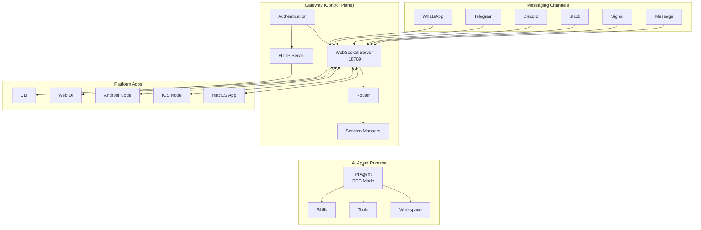
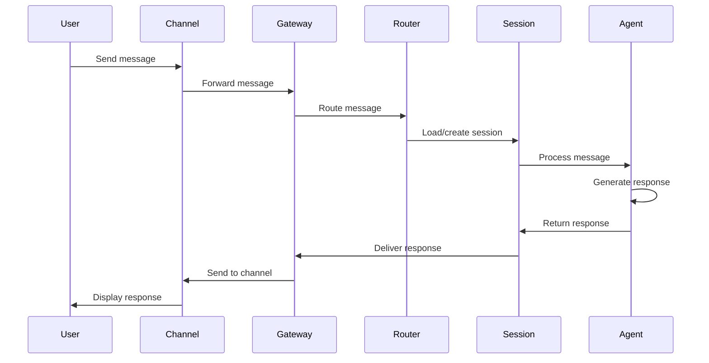
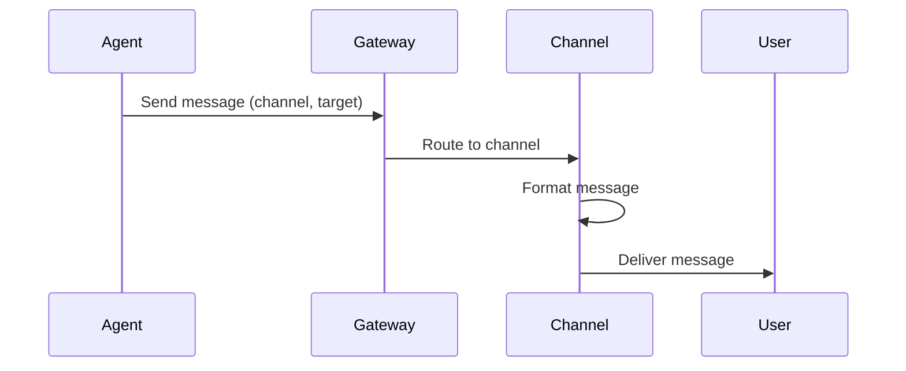
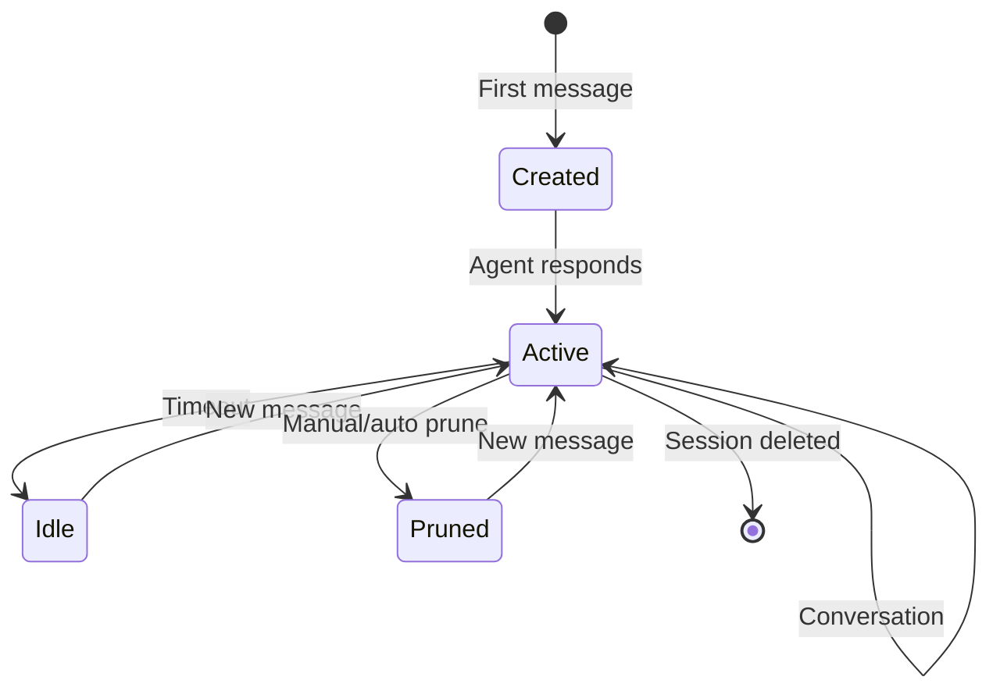

# Architecture

OpenClaw is built as a local-first Gateway that connects AI agents to messaging channels. This page explains the system architecture, component relationships, and data flow.

## High-Level Architecture



## Core Components

### Gateway

The Gateway is the central control plane that runs at `ws://127.0.0.1:18789` (by default).

**Responsibilities**:
- WebSocket server for real-time communication
- HTTP server for Control UI and webhooks
- Session management and routing
- Authentication and authorization
- Channel lifecycle management
- Event broadcasting

**Key Features**:
- Single WebSocket endpoint for all clients
- Background process with daemon support (launchd/systemd)
- Lock file prevents multiple instances
- Configurable bind modes (loopback, LAN, Tailscale)
- Optional TLS support

**Location**: src/gateway/

### Channels

Channels are messaging platform integrations that connect to the Gateway.

**Supported Channels**:
- WhatsApp (Baileys library)
- Telegram (grammY library)
- Discord (discord.js)
- Slack (Bolt SDK)
- Signal (signal-cli)
- iMessage (macOS only, AppleScript bridge)
- Google Chat, Microsoft Teams, Matrix, and more via extensions

**Channel Lifecycle**:
1. Channel initializes and authenticates
2. Channel registers with Gateway
3. Inbound messages routed to sessions
4. Outbound messages delivered through channel

**Location**: src/channels/, extensions/*/

### Sessions

Sessions provide conversation context isolation for each sender.

**Session Key Format**:
```
agent:{agentId}:{channel}:{accountId}:{peerId}
```

Example: `agent:main:telegram:default:user123`

**Session Features**:
- Per-sender isolation
- Group session sharing
- Session pruning and compaction
- Conversation history storage
- Model and settings per session

**Storage**:
- Session data: `~/.openclaw/sessions/`
- Format: JSONL files (one line per turn)

**Location**: src/sessions/, src/routing/session-key.ts:2

### Agents

Agents are AI model runtimes that process messages and generate responses.

**Agent Types**:
- **Main Agent**: Default agent for direct messages
- **Multi-Agent**: Route channels/groups to specialized agents
- **Sub-Agents**: Spawned by sessions for delegation

**Agent Configuration**:
```json
{
  "id": "main",
  "model": "anthropic/claude-opus-4-6",
  "workspace": "~/.openclaw/workspace",
  "sandbox": {
    "mode": "non-main",
    "scope": "session"
  }
}
```

**Agent Features**:
- Pi agent runtime with RPC mode
- Tool streaming and block streaming
- Workspace isolation
- Skill management
- Model fallbacks

**Location**: src/agents/

### Router

The Router determines which agent handles each message based on channel, account, and peer.

**Routing Logic**:
1. Extract channel, account ID, peer ID from message
2. Check routing bindings for explicit matches
3. Fall back to default agent if no match
4. Create or load session for agent + routing key

**Routing Bindings**:
```json
{
  "routing": {
    "bindings": [
      {
        "agentId": "coding",
        "match": {
          "channel": "discord",
          "guildId": "123456789"
        }
      }
    ]
  }
}
```

**Location**: src/routing/

### Tools

Tools extend agent capabilities with external actions.

**Built-in Tools**:
- **bash**: Execute shell commands
- **read/write/edit**: File operations
- **browser**: Web automation with Playwright
- **canvas**: Visual workspace control
- **nodes**: Device-specific actions (camera, screen, etc.)
- **cron**: Schedule jobs
- **sessions_***: Inter-session communication
- **gateway**: Gateway control

**Tool Allowlists**:
```json
{
  "agents": {
    "defaults": {
      "tools": {
        "allow": ["read", "write", "bash"],
        "deny": ["browser"]
      }
    }
  }
}
```

**Location**: src/agents/tools/

## Data Flow

### Inbound Message Flow



### Outbound Message Flow



### Session Lifecycle



## Protocol

### Gateway WebSocket Protocol

Clients connect to `ws://127.0.0.1:18789` and use JSON-RPC 2.0 messages.

**Authentication**:
```json
{
  "method": "auth",
  "params": {
    "token": "your-gateway-token"
  }
}
```

**Agent Request**:
```json
{
  "method": "agent",
  "params": {
    "message": "Hello, assistant!",
    "sessionKey": "main",
    "model": "anthropic/claude-opus-4-6"
  }
}
```

**Events** (pushed from Gateway):
- `agent.text`: Streaming text response
- `agent.thinking`: Extended thinking events
- `agent.tool.start`: Tool invocation started
- `agent.tool.result`: Tool completed
- `presence`: Channel presence updates
- `typing`: Typing indicators

**Location**: src/gateway/protocol.ts

### Agent RPC Protocol

The Gateway communicates with the Pi agent via JSON-RPC over stdin/stdout.

**Request**:
```json
{
  "jsonrpc": "2.0",
  "id": 1,
  "method": "assistant.message",
  "params": {
    "messages": [...],
    "model": "anthropic/claude-opus-4-6",
    "tools": [...]
  }
}
```

**Response**:
```json
{
  "jsonrpc": "2.0",
  "id": 1,
  "result": {
    "text": "Response text",
    "usage": { "inputTokens": 100, "outputTokens": 50 }
  }
}
```

**Location**: src/agents/rpc.ts

## Security Architecture

### Default DM Pairing

Unknown senders receive a pairing code and are blocked until approved:

```
User: Hello
Bot: Please provide your pairing code: ABC123
```

Approve with:
```bash
oclaw pairing approve telegram ABC123
```

**Allowlist Storage**: `~/.openclaw/allowlists/{channel}.json`

### Sandbox Isolation

Group chats run in Docker containers to isolate tool execution:

```json
{
  "agents": {
    "defaults": {
      "sandbox": {
        "mode": "non-main",
        "scope": "session"
      }
    }
  }
}
```

**Sandbox Scope**:
- `session`: One container per session (most isolated)
- `agent`: One container per agent (shared workspace)
- `shared`: Single container for all sandboxed sessions

**Location**: src/sandbox/

### Authentication Modes

- `none`: No authentication (localhost only)
- `token`: Bearer token (X-Gateway-Token header)
- `password`: Password authentication
- `trusted-proxy`: Identity from reverse proxy headers

**Location**: src/gateway/auth.ts:9

## File System Layout

```
~/.openclaw/
├── openclaw.json          # Main configuration
├── sessions/              # Session storage
│   └── agent:main:telegram:default:user123.jsonl
├── workspace/             # Agent workspace
│   ├── AGENTS.md         # Agent system prompt
│   ├── SOUL.md           # Agent personality
│   ├── TOOLS.md          # Tool instructions
│   └── skills/           # Skill modules
├── credentials/           # Channel credentials
│   ├── whatsapp/
│   ├── telegram/
│   └── discord/
├── allowlists/            # DM allowlists
│   ├── telegram.json
│   └── discord.json
├── sandboxes/             # Docker sandbox state
└── logs/                  # Gateway logs
```

## Deployment Patterns

### Local Development

```
[Laptop]
  ├─ Gateway :18789 (loopback)
  ├─ Channels
  ├─ Agent
  └─ macOS App
```

### VPS Deployment

```
[VPS]
  ├─ Gateway :18789 (LAN + auth)
  ├─ Channels
  └─ Agent

[Laptop]
  └─ macOS App (remote connection)
```

### Split Deployment

```
[VPS]
  ├─ Gateway :18789
  └─ Channels

[Laptop]
  ├─ macOS App (node mode)
  └─ Agent (delegated execution)
```

**Location**: docs/guides/deployment.mdx

## Performance Considerations

### WebSocket Connection Limits

The Gateway can handle hundreds of simultaneous WebSocket connections. Practical limits:
- Channels: 10-20 concurrent (one per messaging platform)
- Platform apps: 5-10 (macOS, iOS, Android, web)
- CLI clients: As needed for automation

### Session Scaling

Sessions are loaded on demand and cached in memory:
- Cold load: ~5-10ms per session
- Warm cache: less than 1ms
- Recommended: Prune old sessions periodically

### Message Throughput

Typical throughput:
- Inbound: 100+ messages/second
- Outbound: 50+ messages/second per channel (respecting rate limits)
- Agent processing: Limited by AI provider API

## Extension Points

### Plugin System

OpenClaw supports plugins for extending functionality:

**Hook Types**:
- `channel`: Add new messaging platforms
- `tool`: Add agent tools
- `provider`: Add AI model providers
- `gateway`: Add Gateway features

**Plugin Structure**:
```typescript
import { definePlugin } from "openclaw/plugin-sdk";

export default definePlugin({
  name: "my-plugin",
  version: "1.0.0",
  hooks: {
    channel: {
      // Channel implementation
    }
  }
});
```

**Location**: extensions/, src/plugins/

## Next Steps

<CardGroup cols={2}>
  <Card title="Gateway Details" icon="server" href="/concepts/gateway">
    Deep dive into Gateway configuration and operation
  </Card>
  <Card title="Agent System" icon="robot" href="/concepts/agents">
    Learn about AI agent runtime and configuration
  </Card>
  <Card title="Session Management" icon="layer-group" href="/concepts/sessions">
    Understand session lifecycle and storage
  </Card>
  <Card title="Message Routing" icon="route" href="/concepts/routing">
    Configure multi-agent routing rules
  </Card>
</CardGroup>