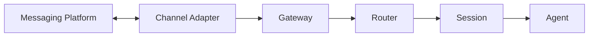
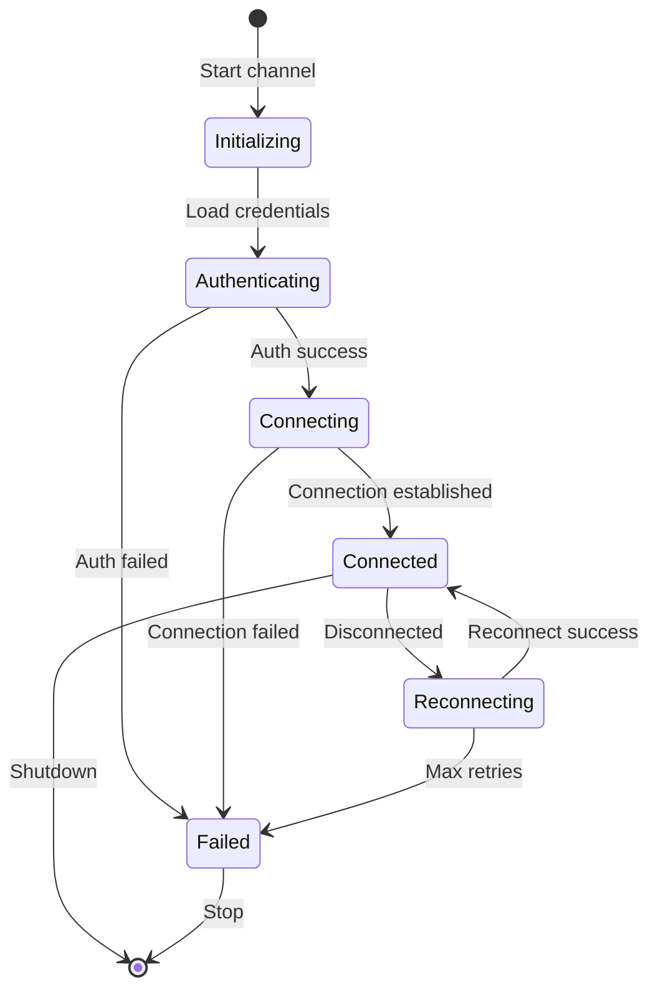

# Channels

Channels are messaging platform integrations that connect OpenClaw to WhatsApp, Telegram, Discord, Slack, Signal, iMessage, and other platforms. Each channel handles platform-specific authentication, message normalization, and delivery.

## What is a Channel?

A channel is a messaging platform adapter that:
- **Authenticates** with the messaging platform
- **Receives inbound messages** and normalizes them
- **Delivers outbound messages** from agents
- **Manages platform-specific features** (media, reactions, threads)
- **Enforces access control** via allowlists and pairing



## Supported Channels

OpenClaw supports multiple messaging platforms out of the box:

<CardGroup cols={3}>
  <Card title="WhatsApp" icon="whatsapp">
    Web-based via Baileys library
  </Card>
  <Card title="Telegram" icon="telegram">
    Bot API via grammY
  </Card>
  <Card title="Discord" icon="discord">
    Bot via discord.js
  </Card>
  <Card title="Slack" icon="slack">
    App via Bolt SDK
  </Card>
  <Card title="Signal" icon="message">
    CLI-based via signal-cli
  </Card>
  <Card title="iMessage" icon="message">
    macOS only, AppleScript bridge
  </Card>
</CardGroup>

**Extension Channels**:
- Microsoft Teams
- Google Chat
- Matrix
- Zalo
- Voice Call

**Location**: src/channels/, extensions/*/

## Channel Configuration

### Basic Setup

Channels are configured under `channels.<channel-id>` in your OpenClaw config:

```json
{
  "channels": {
    "telegram": {
      "token": "your-bot-token",
      "allowFrom": ["*"]
    },
    "discord": {
      "token": "your-bot-token",
      "allowFrom": ["user123", "user456"]
    }
  }
}
```

**Location**: src/channels/plugins/config-schema.ts:1

### Channel-Specific Settings

Each channel has unique configuration options:

**WhatsApp**:
```json
{
  "channels": {
    "whatsapp": {
      "allowFrom": ["*"],
      "groupPolicy": "open",
      "mediaDownloadDir": "~/.openclaw/media",
      "heartbeatSeconds": 300
    }
  }
}
```

**Telegram**:
```json
{
  "channels": {
    "telegram": {
      "token": "bot-token",
      "allowFrom": ["123456789"],
      "textChunkLimit": 4096,
      "groupPolicy": "allowlist"
    }
  }
}
```

**Discord**:
```json
{
  "channels": {
    "discord": {
      "token": "bot-token",
      "allowFrom": ["guild:123456789"],
      "groupPolicy": "open",
      "requireMention": true
    }
  }
}
```

**Location**: src/channels/plugins/

## Channel Types

### Chat Types

Channels support different chat types:

- **direct**: Direct messages (DMs) with individual users
- **group**: Group chats with multiple participants
- **channel**: Broadcast channels (Telegram, Slack)
- **thread**: Threaded conversations

```typescript
type ChatType = "direct" | "group" | "channel" | "thread";
```

**Location**: src/channels/chat-type.ts:1

### Account Support

Some channels support multiple accounts:

```json
{
  "channels": {
    "telegram": {
      "accounts": {
        "default": {
          "token": "bot-token-1",
          "allowFrom": ["*"]
        },
        "work": {
          "token": "bot-token-2",
          "allowFrom": ["team-members"]
        }
      }
    }
  }
}
```

**Location**: src/channels/plugins/account-helpers.ts:1

## Message Routing

### Allowlists (Access Control)

Channels use allowlists to control who can message the agent:

```json
{
  "channels": {
    "telegram": {
      "allowFrom": [
        "123456789",
        "user:alice",
        "*"
      ]
    }
  }
}
```

**Allowlist Patterns**:
- `*`: Allow everyone (wildcard)
- `123456789`: User ID
- `user:alice`: Username
- `@alice`: Username with @ prefix
- `+15551234567`: Phone number (E.164 format)

**Location**: src/channels/plugins/allowlist-match.ts:1

<Note>
For production, use explicit allowlists instead of `*` to prevent unauthorized access.
</Note>

### Group Policies

Control how the agent responds in group chats:

```json
{
  "channels": {
    "discord": {
      "groupPolicy": "open",
      "requireMention": true
    }
  }
}
```

**Group Policy Options**:
- `open`: Allow all group messages (mention gating applies)
- `allowlist`: Only allow messages from users in allowlist
- `disabled`: Ignore all group messages

**Location**: src/config/types.base.ts:8

### Mention Patterns

In group chats, the agent responds when mentioned:

```json
{
  "channels": {
    "discord": {
      "requireMention": true,
      "mentionRegexes": [
        "@bot",
        "\\bhey bot\\b"
      ]
    }
  }
}
```

**Built-in Mention Detection**:
- Discord: `@bot-name`
- Telegram: `@bot_username`
- Slack: `@bot-name`
- WhatsApp: Quote replies

**Location**: src/channels/mention-gating.ts:1, src/channels/plugins/group-mentions.ts:1

### DM vs Group Routing

Direct messages and group chats can route to different agents:

```json
{
  "routing": {
    "bindings": [
      {
        "agentId": "personal",
        "match": {
          "channel": "telegram",
          "peer": { "kind": "direct" }
        }
      },
      {
        "agentId": "support",
        "match": {
          "channel": "telegram",
          "peer": { "kind": "group", "id": "-1001234567890" }
        }
      }
    ]
  }
}
```

**Location**: src/routing/resolve-route.ts:295

## Pairing Flow

### DM Pairing (Security)

By default, unknown DM senders must pair before accessing the agent:

1. **User sends first message**:
   ```
   User: Hello!
   ```

2. **Bot sends pairing code**:
   ```
   Bot: Please provide your pairing code: ABC123
   ```

3. **Admin approves pairing**:
   ```bash
   oclaw pairing approve telegram ABC123
   ```

4. **User can now chat**:
   ```
   Bot: You're now paired! How can I help?
   User: What's the weather?
   ```

**Pairing Storage**: `~/.openclaw/allowlists/{channel}.json`

**Location**: src/channels/plugins/pairing.ts:1, src/pairing/

### Pairing Commands

```bash
# List pending pairing requests
oclaw pairing list

# Approve a pairing request
oclaw pairing approve <channel> <code>

# Reject a pairing request
oclaw pairing reject <channel> <code>

# List approved users
oclaw pairing show telegram
```

**Location**: src/commands/pairing.ts:1

<Tip>
Use `"allowFrom": ["*"]` to skip pairing and allow all users (not recommended for production).
</Tip>

## Channel Status

### Monitoring Channels

Check channel connection status:

```bash
# Quick status
oclaw channels status

# Detailed status with probes
oclaw channels status --deep

# All channels (including inactive)
oclaw channels status --all
```

**Output**:
```
CHANNEL     STATUS    ACCOUNTS  LAST MESSAGE
telegram    online    1         2 minutes ago
discord     online    1         5 minutes ago
whatsapp    offline   1         —
```

**Location**: src/commands/channels.ts:1

### Channel Lifecycle



**Location**: src/channels/plugins/status.ts:1

## Channel Configuration Examples

### Multi-Account Setup

```json
{
  "channels": {
    "telegram": {
      "accounts": {
        "default": {
          "token": "bot-token-personal",
          "allowFrom": ["*"]
        },
        "work": {
          "token": "bot-token-work",
          "allowFrom": ["team-member-1", "team-member-2"]
        }
      }
    }
  }
}
```

### DM-Only Mode

```json
{
  "channels": {
    "discord": {
      "token": "bot-token",
      "groupPolicy": "disabled",
      "allowFrom": ["user123", "user456"]
    }
  }
}
```

### Open Groups, Restricted DMs

```json
{
  "channels": {
    "telegram": {
      "token": "bot-token",
      "allowFrom": ["admin-id"],
      "groupPolicy": "open",
      "requireMention": true
    }
  }
}
```

### Channel-Specific Media Settings

```json
{
  "channels": {
    "whatsapp": {
      "mediaDownloadDir": "~/.openclaw/media/whatsapp",
      "mediaMaxSizeMb": 16
    },
    "telegram": {
      "mediaDownloadDir": "~/.openclaw/media/telegram",
      "mediaMaxSizeMb": 50
    }
  }
}
```

**Location**: src/channels/plugins/media-limits.ts:1

## Advanced Features

### Message Actions

Channels support platform-specific actions:

- **Reactions**: React to messages with emoji
- **Edits**: Edit sent messages
- **Deletions**: Delete messages
- **Typing Indicators**: Show "typing..." status
- **Read Receipts**: Mark messages as read

**Location**: src/channels/plugins/message-actions.ts:1

### Media Handling

Channels automatically download and process media:

- Images: JPG, PNG, GIF, WebP
- Videos: MP4, MOV, WebM
- Audio: MP3, OGG, M4A
- Documents: PDF, TXT, DOCX
- Voice Messages: Platform-specific formats

**Location**: src/channels/plugins/normalize/

### Thread Support

Channels that support threads (Discord, Slack) create sub-sessions:

```json
{
  "session": {
    "resetByType": {
      "thread": {
        "mode": "idle",
        "idleMinutes": 60
      }
    }
  }
}
```

**Location**: src/routing/session-key.ts:254

## Troubleshooting

### Channel Won't Connect

1. **Check credentials**:
   ```bash
   oclaw config get channels.telegram.token
   ```

2. **Verify channel status**:
   ```bash
   oclaw channels status --deep
   ```

3. **Check logs**:
   ```bash
   oclaw logs --follow
   ```

### Messages Not Delivered

1. **Verify allowlist**:
   ```bash
   oclaw config get channels.telegram.allowFrom
   ```

2. **Check pairing status**:
   ```bash
   oclaw pairing list
   ```

3. **Test routing**:
   ```bash
   oclaw routing test telegram user123
   ```

### Channel Authentication Failed

**Telegram**:
```bash
# Re-authenticate
oclaw login telegram --token your-bot-token
```

**Discord**:
```bash
# Re-authenticate
oclaw login discord --token your-bot-token
```

**WhatsApp**:
```bash
# Re-pair (generates new QR code)
oclaw login whatsapp --force
```

**Location**: src/commands/login.ts:1

<Warning>
Never commit channel credentials to version control. Use environment variables or secure storage.
</Warning>

## Next Steps

<CardGroup cols={2}>
  <Card title="Session Management" icon="layer-group" href="/concepts/sessions">
    Learn how sessions track conversation context
  </Card>
  <Card title="Message Routing" icon="route" href="/concepts/routing">
    Configure multi-agent routing rules
  </Card>
  <Card title="Channel Setup Guides" icon="book" href="/channels">
    Platform-specific setup instructions
  </Card>
  <Card title="Access Control" icon="shield" href="/configuration/security">
    Advanced security and allowlist configuration
  </Card>
</CardGroup>