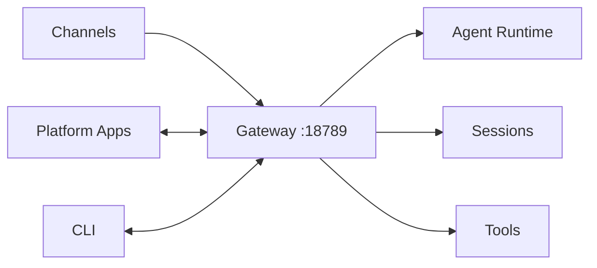

# Gateway

The Gateway is the heart of OpenClaw—a WebSocket server that acts as the central control plane for all messaging channels, AI agents, and platform apps.

## What is the Gateway?

The Gateway is a background process that:
- **Runs a WebSocket server** at `ws://127.0.0.1:18789` (default)
- **Manages messaging channels** (WhatsApp, Telegram, Discord, etc.)
- **Routes messages** to appropriate AI agents based on configuration
- **Maintains sessions** for conversation context
- **Provides HTTP endpoints** for Control UI and webhooks
- **Broadcasts events** to connected clients



## Gateway Process

### Starting the Gateway

**Manual Start**:
```bash
oclaw gateway --port 18789 --verbose
```

**With Daemon**:
```bash
# Install daemon (launchd/systemd)
oclaw onboard --install-daemon

# Start/stop (systemd)
systemctl --user start openclaw-gateway
systemctl --user stop openclaw-gateway

# macOS (launchd)
launchctl start openclaw-gateway
launchctl stop openclaw-gateway
```

**Location**: src/gateway/, src/daemon/

### Gateway Lock

The Gateway uses a lock file to prevent multiple instances:

```
~/.openclaw/.gateway.lock
```

If the Gateway won't start, check for stale lock files:
```bash
oclaw gateway --force
```

**Location**: src/infra/gateway-lock.ts:6

### Process Modes

The Gateway can run in different modes:

1. **Local**: Binds to 127.0.0.1 (default, most secure)
2. **LAN**: Binds to 0.0.0.0 (all interfaces)
3. **Tailscale**: Auto-configures Tailscale Serve/Funnel
4. **Custom**: Specific IP address

**Configuration**:
```json
{
  "gateway": {
    "bind": "loopback",
    "port": 18789
  }
}
```

**Location**: src/config/types.gateway.ts:1

## WebSocket Server

The Gateway's WebSocket server provides real-time communication between channels, agents, and clients.

### Connection

Connect to the Gateway:
```javascript
const ws = new WebSocket('ws://127.0.0.1:18789');

ws.on('open', () => {
  // Authenticate
  ws.send(JSON.stringify({
    method: 'auth',
    params: { token: 'your-token' }
  }));
});
```

### Authentication

The Gateway supports multiple auth modes:

**Token Authentication**:
```json
{
  "method": "auth",
  "params": {
    "token": "your-gateway-token"
  }
}
```

**Password Authentication**:
```json
{
  "method": "auth",
  "params": {
    "password": "your-password"
  }
}
```

**Configuration**:
```json
{
  "gateway": {
    "auth": {
      "mode": "token",
      "token": "secure-random-token-here"
    }
  }
}
```

<Warning>
Always use authentication when binding to non-localhost interfaces.
</Warning>

**Location**: src/gateway/auth.ts:9

### Protocol Methods

The Gateway supports these JSON-RPC methods:

#### agent

Send a message to the agent:
```json
{
  "method": "agent",
  "params": {
    "message": "Hello, what can you help with?",
    "sessionKey": "main",
    "model": "anthropic/claude-opus-4-6",
    "thinkingLevel": "medium"
  }
}
```

#### sessions.list

List all active sessions:
```json
{
  "method": "sessions.list",
  "params": {}
}
```

#### sessions.get

Get session details:
```json
{
  "method": "sessions.get",
  "params": {
    "sessionKey": "agent:main:telegram:default:user123"
  }
}
```

#### channels.status

Get channel status:
```json
{
  "method": "channels.status",
  "params": {}
}
```

#### gateway.info

Get Gateway information:
```json
{
  "method": "gateway.info",
  "params": {}
}
```

### Event Streaming

The Gateway pushes events to connected clients:

**Agent Events**:
- `agent.text`: Streaming text response
- `agent.thinking`: Extended thinking output
- `agent.tool.start`: Tool invocation started
- `agent.tool.result`: Tool execution result
- `agent.done`: Message complete

**Channel Events**:
- `presence`: Channel online/offline status
- `typing`: Typing indicators
- `message`: Inbound message

**Session Events**:
- `session.created`: New session
- `session.updated`: Session metadata changed
- `session.pruned`: Session history compacted

**Example Event**:
```json
{
  "event": "agent.text",
  "data": {
    "sessionKey": "main",
    "text": "Here's the answer...",
    "delta": "answer..."
  }
}
```

## HTTP Server

The Gateway also runs an HTTP server for web access and webhooks.

### Control UI

Access the Control UI at `http://127.0.0.1:18789/`:

```json
{
  "gateway": {
    "controlUi": {
      "enabled": true,
      "basePath": "/",
      "allowedOrigins": ["https://yourapp.com"]
    }
  }
}
```

The Control UI provides:
- **Dashboard**: Gateway status and metrics
- **Sessions**: View and manage sessions
- **Channels**: Channel status and configuration
- **WebChat**: Browser-based chat interface
- **Logs**: Real-time log streaming
- **Configuration**: Edit config via UI


**Location**: src/provider-web.ts, ui/

### REST Endpoints

#### GET /health

Health check endpoint:
```bash
curl http://127.0.0.1:18789/health
```

Response:
```json
{
  "status": "ok",
  "version": "2026.2.19",
  "uptime": 3600
}
```

#### POST /webhook

Webhook endpoint for external triggers:
```bash
curl -X POST http://127.0.0.1:18789/webhook/my-hook \
  -H "Content-Type: application/json" \
  -d '{"message": "Hello from webhook"}'
```

Configure webhooks:
```json
{
  "hooks": {
    "webhooks": [
      {
        "id": "my-hook",
        "path": "/webhook/my-hook",
        "agentId": "main",
        "message": "Webhook triggered: {{body.message}}"
      }
    ]
  }
}
```

**Location**: src/hooks/

## Configuration

### Basic Configuration

```json
{
  "gateway": {
    "port": 18789,
    "bind": "loopback",
    "mode": "local"
  }
}
```

### Remote Access

**LAN Access**:
```json
{
  "gateway": {
    "port": 18789,
    "bind": "lan",
    "auth": {
      "mode": "password",
      "password": "secure-password"
    }
  }
}
```

**Tailscale Serve** (tailnet-only):
```json
{
  "gateway": {
    "bind": "loopback",
    "tailscale": {
      "mode": "serve"
    }
  }
}
```

**Tailscale Funnel** (public):
```json
{
  "gateway": {
    "bind": "loopback",
    "auth": {
      "mode": "password",
      "password": "required-for-funnel"
    },
    "tailscale": {
      "mode": "funnel",
      "resetOnExit": true
    }
  }
}
```

<Info>
Tailscale Serve/Funnel requires the `tailscale` CLI to be installed and authenticated.
</Info>

### TLS Configuration

```json
{
  "gateway": {
    "tls": {
      "enabled": true,
      "certPath": "~/.openclaw/certs/cert.pem",
      "keyPath": "~/.openclaw/certs/key.pem",
      "autoGenerate": true
    }
  }
}
```

Auto-generated certificates are self-signed and suitable for development. For production, use certificates from Let's Encrypt or your CA.

**Location**: src/infra/tls/

### Discovery Configuration

**mDNS/Bonjour**:
```json
{
  "gateway": {
    "discovery": {
      "mdns": {
        "mode": "minimal"
      }
    }
  }
}
```

Modes:
- `off`: Disable mDNS entirely
- `minimal`: Advertise Gateway without sensitive info
- `full`: Include CLI path and SSH port in TXT records

**Wide-Area Discovery**:
```json
{
  "gateway": {
    "discovery": {
      "wideArea": {
        "enabled": true,
        "domain": "openclaw.internal"
      }
    }
  }
}
```

**Location**: src/config/types.gateway.ts:16

## Management

### Status

Check Gateway status:
```bash
oclaw gateway status
```

Output:
```
Gateway Status
--------------
Running: Yes
PID: 12345
Uptime: 2h 34m
Port: 18789
Bind: loopback
Channels: 3 connected
Sessions: 12 active
```

### Logs

View Gateway logs:
```bash
# Follow logs
oclaw logs --follow

# Last 100 lines
oclaw logs --tail 100

# Filter by level
oclaw logs --level error
```

**Log Locations**:
- Daemon logs: `~/.openclaw/logs/gateway.log`
- Console output: stderr when running manually

**Location**: src/logging/

### Restart

Restart the Gateway:
```bash
oclaw gateway restart
```

Or manually:
```bash
oclaw gateway stop
oclaw gateway start
```

### Diagnostics

Run Gateway diagnostics:
```bash
oclaw doctor
```

This checks:
- Configuration validity
- Port availability
- File permissions
- Channel credentials
- Session integrity
- Migration status

**Location**: src/commands/doctor.ts

## Performance

### Connection Limits

- **Channels**: 10-20 concurrent
- **Platform apps**: 5-10
- **CLI clients**: Unlimited
- **WebSocket connections**: Hundreds

### Memory Usage

Typical memory footprint:
- Base: 100-200 MB
- +10-50 MB per channel
- +1-5 MB per active session

### CPU Usage

- Idle: less than 1%
- Active messaging: 5-15%
- Peak (tool execution): 30-60%

## Security

### Default Security

- Binds to localhost by default
- No authentication required for localhost
- DM pairing for unknown senders
- Allowlists for channel access

### Production Security

<Steps>
  <Step title="Enable authentication">
    ```json
    {
      "gateway": {
        "auth": {
          "mode": "token",
          "token": "generate-secure-random-token"
        }
      }
    }
    ```
  </Step>

  <Step title="Enable TLS">
    ```json
    {
      "gateway": {
        "tls": {
          "enabled": true,
          "certPath": "/path/to/cert.pem",
          "keyPath": "/path/to/key.pem"
        }
      }
    }
    ```
  </Step>

  <Step title="Configure firewall">
    Only allow connections from trusted IPs:
    ```bash
    # iptables example
    iptables -A INPUT -p tcp --dport 18789 -s 192.168.1.0/24 -j ACCEPT
    iptables -A INPUT -p tcp --dport 18789 -j DROP
    ```
  </Step>

  <Step title="Use reverse proxy">
    Run behind Caddy, nginx, or Pomerium for additional auth:
    ```
    Caddy -> OpenClaw Gateway
    (OAuth)   (localhost only)
    ```
  </Step>
</Steps>

See the [security guide](/guides/security) for detailed recommendations.

## Troubleshooting

<AccordionGroup>
  <Accordion title="Gateway won't start">
    Check for:
    1. Port conflicts: `lsof -i :18789` or `ss -ltnp | grep 18789`
    2. Stale lock file: `rm ~/.openclaw/.gateway.lock`
    3. Config errors: `openclaw config validate`
    4. Permission issues: Check `~/.openclaw/` permissions
  </Accordion>

  <Accordion title="Can't connect to Gateway">
    Verify:
    1. Gateway is running: `openclaw gateway status`
    2. Correct port: Check `gateway.port` in config
    3. Firewall: Ensure port is open
    4. Authentication: Use correct token/password
  </Accordion>

  <Accordion title="High memory usage">
    Common causes:
    1. Too many active sessions: Prune old sessions
    2. Large message history: Enable auto-compaction
    3. Memory leak: Restart Gateway and file a bug report
  </Accordion>

  <Accordion title="Channels disconnecting">
    Check:
    1. Network connectivity
    2. Channel credentials validity
    3. Rate limiting (too many messages)
    4. Gateway logs for errors
  </Accordion>
</AccordionGroup>

## Next Steps

<CardGroup cols={2}>
  <Card title="Agents" icon="robot" href="/concepts/agents">
    Learn about AI agent configuration and runtime
  </Card>
  <Card title="Channels" icon="messages" href="/concepts/channels">
    Configure messaging channel integrations
  </Card>
  <Card title="Sessions" icon="layer-group" href="/concepts/sessions">
    Understand session management and storage
  </Card>
  <Card title="Deployment" icon="server" href="/guides/deployment">
    Deploy Gateway to production environments
  </Card>
</CardGroup>