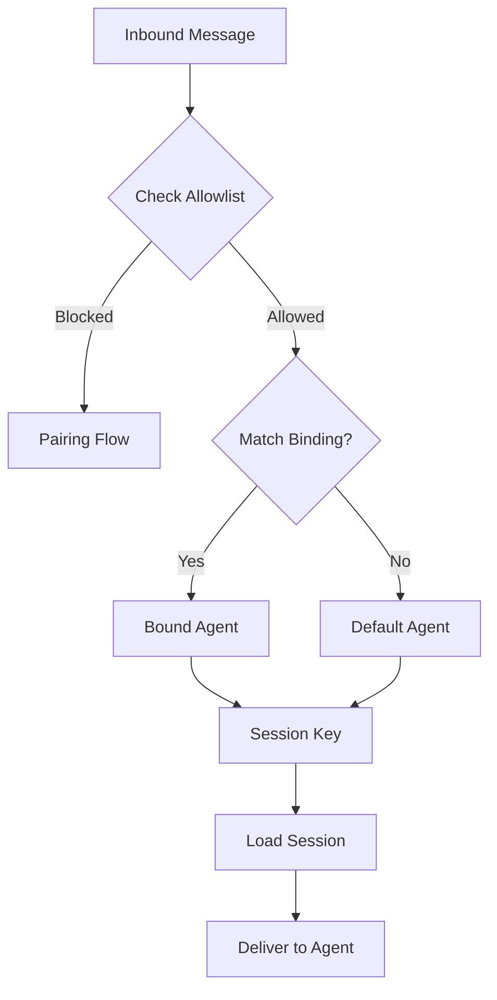
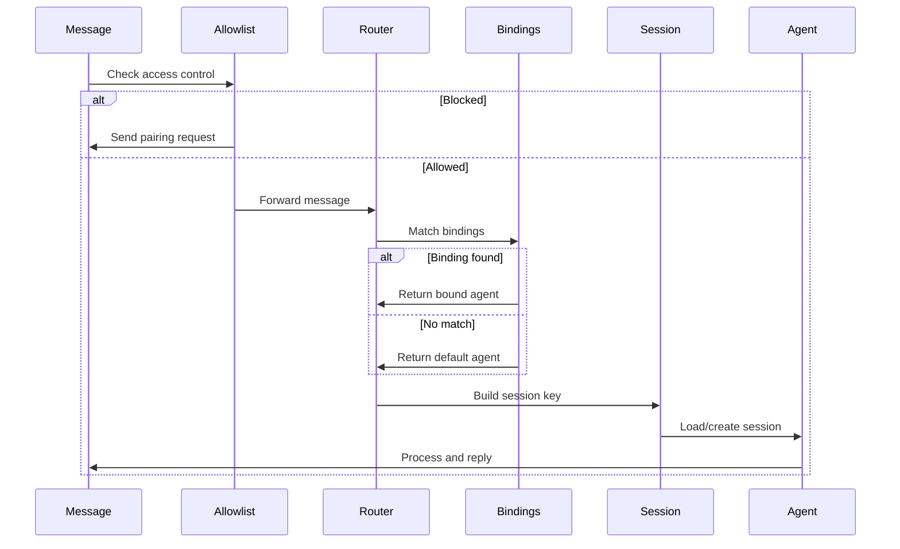
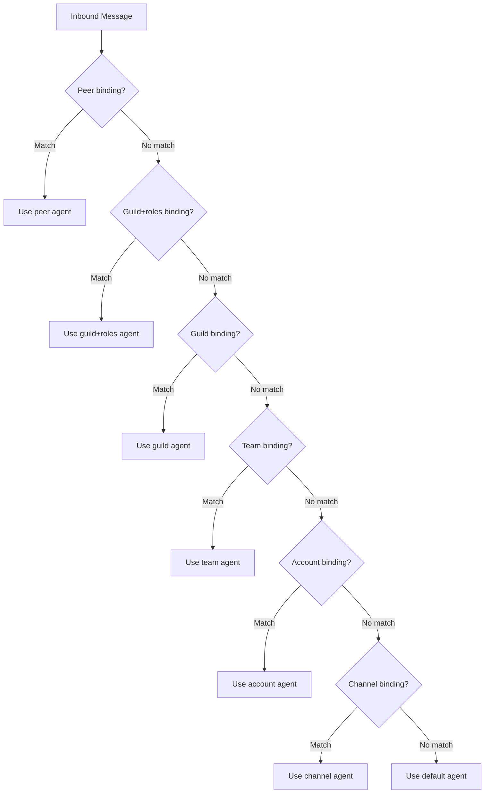
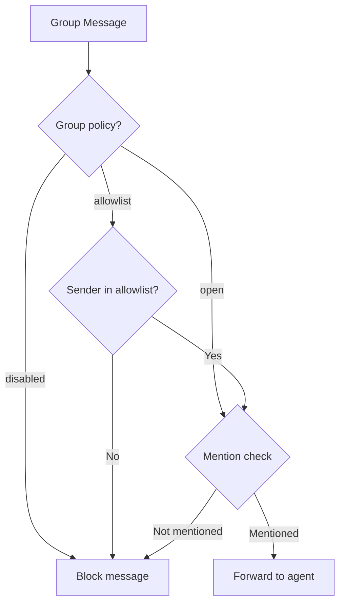

# Routing

Routing determines which agent handles each message based on channel, account, peer, and guild. OpenClaw supports complex routing rules for multi-agent setups, group policies, and access control.

## What is Routing?

Routing maps incoming messages to agents and sessions:

1. **Extract identifiers** from inbound message (channel, account, peer)
2. **Match routing bindings** against message context
3. **Select agent** based on match or default
4. **Build session key** for agent + routing context
5. **Load/create session** and deliver message



## Routing Basics

### Default Routing

Without routing configuration, all messages go to the default agent:

```json
{
  "agent": {
    "model": "anthropic/claude-opus-4-6"
  }
}
```

All messages route to `agent:main`.

**Location**: src/routing/resolve-route.ts:438

### Simple Multi-Agent Routing

Route different channels to different agents:

```json
{
  "agents": {
    "list": [
      {
        "id": "main",
        "model": "anthropic/claude-opus-4-6"
      },
      {
        "id": "coding",
        "model": "anthropic/claude-opus-4-6",
        "workspace": "~/projects/code"
      }
    ]
  },
  "routing": {
    "bindings": [
      {
        "agentId": "coding",
        "match": {
          "channel": "discord"
        }
      }
    ]
  }
}
```

Now:
- **Telegram messages** → `main` agent (default)
- **Discord messages** → `coding` agent

**Location**: src/routing/bindings.ts:1

## Routing Bindings

### Binding Structure

Routing bindings map message patterns to agents:

```typescript
type RoutingBinding = {
  agentId: string;
  match: {
    channel?: string;
    accountId?: string;
    peer?: {
      kind: "direct" | "group" | "channel" | "thread";
      id: string;
    };
    guildId?: string;
    teamId?: string;
    roles?: string[];
  };
};
```

**Location**: src/routing/resolve-route.ts:20

### Binding Priority

Bindings are evaluated in order of specificity:

1. **Peer match** (specific user/group)
2. **Parent peer match** (thread inherits from parent)
3. **Guild + roles** (Discord server + member roles)
4. **Guild** (Discord server)
5. **Team** (Slack workspace)
6. **Account** (specific account)
7. **Channel** (messaging platform)
8. **Default** (fallback)

**Location**: src/routing/resolve-route.ts:366

<Info>
More specific bindings take precedence over generic ones.
</Info>

## Routing Examples

### Route by Channel

```json
{
  "routing": {
    "bindings": [
      {
        "agentId": "personal",
        "match": { "channel": "telegram" }
      },
      {
        "agentId": "work",
        "match": { "channel": "slack" }
      }
    ]
  }
}
```

### Route by Account

```json
{
  "routing": {
    "bindings": [
      {
        "agentId": "primary",
        "match": {
          "channel": "telegram",
          "accountId": "default"
        }
      },
      {
        "agentId": "secondary",
        "match": {
          "channel": "telegram",
          "accountId": "work"
        }
      }
    ]
  }
}
```

### Route by Peer (User/Group)

```json
{
  "routing": {
    "bindings": [
      {
        "agentId": "alice-agent",
        "match": {
          "channel": "telegram",
          "peer": {
            "kind": "direct",
            "id": "123456789"
          }
        }
      },
      {
        "agentId": "support-agent",
        "match": {
          "channel": "discord",
          "peer": {
            "kind": "group",
            "id": "987654321"
          }
        }
      }
    ]
  }
}
```

### Route by Guild (Discord)

```json
{
  "routing": {
    "bindings": [
      {
        "agentId": "community-agent",
        "match": {
          "channel": "discord",
          "guildId": "123456789012345678"
        }
      }
    ]
  }
}
```

### Route by Roles (Discord)

```json
{
  "routing": {
    "bindings": [
      {
        "agentId": "admin-agent",
        "match": {
          "channel": "discord",
          "guildId": "123456789012345678",
          "roles": ["admin", "moderator"]
        }
      }
    ]
  }
}
```

Members with `admin` OR `moderator` role route to `admin-agent`.

**Location**: src/routing/resolve-route.ts:284

### Wildcard Account Routing

```json
{
  "routing": {
    "bindings": [
      {
        "agentId": "global-agent",
        "match": {
          "channel": "telegram",
          "accountId": "*"
        }
      }
    ]
  }
}
```

Matches all accounts for Telegram.

**Location**: src/routing/resolve-route.ts:408

## Routing Flow

### Complete Routing Flow



### Routing Decision Tree



**Location**: src/routing/resolve-route.ts:418

## Allowlists (Access Control)

### Channel Allowlists

Control who can message through each channel:

```json
{
  "channels": {
    "telegram": {
      "allowFrom": ["*"]
    },
    "discord": {
      "allowFrom": ["user123", "user456"]
    }
  }
}
```

**Allowlist Matching**:
- Wildcard `*`: Allow everyone
- User ID: `123456789`
- Username: `user:alice` or `@alice`
- Phone: `+15551234567`
- Guild: `guild:123456789`

**Location**: src/channels/plugins/allowlist-match.ts:1

### Account-Specific Allowlists

```json
{
  "channels": {
    "telegram": {
      "accounts": {
        "default": {
          "token": "bot-token-1",
          "allowFrom": ["*"]
        },
        "work": {
          "token": "bot-token-2",
          "allowFrom": ["team-member-1", "team-member-2"]
        }
      }
    }
  }
}
```

**Location**: src/channels/plugins/account-helpers.ts:1

### Nested Allowlists

Channel and account allowlists combine:

```json
{
  "channels": {
    "telegram": {
      "allowFrom": ["admin"],
      "accounts": {
        "public": {
          "allowFrom": ["*"]
        }
      }
    }
  }
}
```

**Logic**:
1. Check channel allowlist (must include "admin" OR account has wildcard)
2. Check account allowlist (must match or be wildcard)

**Location**: src/channels/channel-config.ts:165

## Group Policies

### Group Policy Types

```json
{
  "channels": {
    "discord": {
      "groupPolicy": "open"
    }
  }
}
```

**Policy Options**:

| Policy | Behavior |
|--------|----------|
| `open` | Allow all group messages (mention gating applies) |
| `allowlist` | Only allow senders in `allowFrom` |
| `disabled` | Ignore all group messages |

**Default**: `open`

**Location**: src/config/types.base.ts:8

### Group Access Control Flow



**Location**: src/web/inbound/access-control.ts:82

### Mention Gating

In group chats, require mentions to respond:

```json
{
  "channels": {
    "discord": {
      "requireMention": true,
      "mentionRegexes": [
        "@bot",
        "\\bhey bot\\b"
      ]
    }
  }
}
```

**Built-in Mention Detection**:
- Discord: `@bot-name`
- Telegram: `@bot_username`
- Slack: `@bot-name`
- WhatsApp: Quote/reply to bot

**Location**: src/channels/mention-gating.ts:1, src/channels/plugins/group-mentions.ts:1

### Group vs DM Routing

Route DMs and groups to different agents:

```json
{
  "routing": {
    "bindings": [
      {
        "agentId": "personal",
        "match": {
          "channel": "discord",
          "peer": { "kind": "direct" }
        }
      },
      {
        "agentId": "community",
        "match": {
          "channel": "discord",
          "peer": { "kind": "group" }
        }
      }
    ]
  }
}
```

**Location**: src/routing/resolve-route.ts:295

## DM-Only Mode

Ignore all group messages:

```json
{
  "channels": {
    "telegram": {
      "groupPolicy": "disabled",
      "allowFrom": ["alice", "bob"]
    }
  }
}
```

**Location**: src/config/types.base.ts:8

## Multi-Agent Routing Table

### Complex Routing Example

```json
{
  "agents": {
    "list": [
      { "id": "main", "model": "anthropic/claude-opus-4-6" },
      { "id": "coding", "model": "anthropic/claude-opus-4-6" },
      { "id": "support", "model": "google/gemini-2.0" },
      { "id": "admin", "model": "anthropic/claude-opus-4-6" }
    ]
  },
  "routing": {
    "bindings": [
      {
        "agentId": "coding",
        "match": {
          "channel": "discord",
          "guildId": "123456789012345678"
        }
      },
      {
        "agentId": "support",
        "match": {
          "channel": "telegram",
          "peer": { "kind": "group", "id": "-1001234567890" }
        }
      },
      {
        "agentId": "admin",
        "match": {
          "channel": "slack",
          "teamId": "T01234567"
        }
      }
    ]
  }
}
```

**Routing Table**:

| Channel | Context | Agent |
|---------|---------|-------|
| Discord | Guild 123456789012345678 | `coding` |
| Telegram | Group -1001234567890 | `support` |
| Slack | Team T01234567 | `admin` |
| Any | Default | `main` |

**Location**: src/routing/resolve-route.ts:295

## Routing Testing

### Test Routing Rules

```bash
# Test routing for a message
oclaw routing test telegram user123

# Test group routing
oclaw routing test discord --guild 123456789012345678

# Test with roles
oclaw routing test discord --guild 123456789012345678 --roles admin,moderator

# Test with account
oclaw routing test telegram --account work user456
```

**Output**:
```
Routing Result:
  Agent ID: coding
  Session Key: agent:coding:discord:default:group:123456789012345678
  Matched By: binding.guild
```

**Location**: src/commands/routing.ts:1

### Debug Routing

Enable verbose routing logs:

```bash
oclaw gateway --verbose
```

**Log Output**:
```
[routing] resolveAgentRoute: channel=telegram accountId=default peer=direct:123456789
[routing] binding: agentId=coding accountPattern=default peer=none guildId=none
[routing] match: matchedBy=binding.channel agentId=coding
```

**Location**: src/routing/resolve-route.ts:347

## Advanced Routing

### Thread Routing

Threads inherit routing from parent:

```json
{
  "routing": {
    "bindings": [
      {
        "agentId": "support",
        "match": {
          "channel": "discord",
          "peer": { "kind": "channel", "id": "987654321" }
        }
      }
    ]
  }
}
```

Threads in channel `987654321` route to `support` agent.

**Location**: src/routing/resolve-route.ts:356

### Session Key Building

Routing builds session keys:

```typescript
const sessionKey = buildAgentSessionKey({
  agentId: "main",
  channel: "telegram",
  accountId: "default",
  peer: { kind: "direct", id: "123456789" },
  dmScope: "per-channel-peer"
});
// => "agent:main:telegram:direct:123456789"
```

**Location**: src/routing/resolve-route.ts:90

### Identity Resolution

Identity links affect session keys:

```json
{
  "session": {
    "dmScope": "per-peer",
    "identityLinks": {
      "alice": [
        "telegram:123456789",
        "discord:987654321"
      ]
    }
  }
}
```

Both identities resolve to:
```
agent:main:direct:alice
```

**Location**: src/routing/session-key.ts:190

## Configuration Examples

### Personal + Work Split

```json
{
  "agents": {
    "list": [
      { "id": "personal", "model": "anthropic/claude-opus-4-6" },
      { "id": "work", "model": "anthropic/claude-opus-4-6" }
    ]
  },
  "routing": {
    "bindings": [
      {
        "agentId": "work",
        "match": {
          "channel": "slack"
        }
      },
      {
        "agentId": "work",
        "match": {
          "channel": "discord",
          "guildId": "work-guild-id"
        }
      }
    ]
  }
}
```

### Multi-Channel Support Setup

```json
{
  "agents": {
    "list": [
      { "id": "support", "model": "google/gemini-2.0" }
    ]
  },
  "channels": {
    "telegram": {
      "groupPolicy": "open",
      "requireMention": true
    },
    "discord": {
      "groupPolicy": "open",
      "requireMention": true
    },
    "whatsapp": {
      "groupPolicy": "allowlist",
      "allowFrom": ["admin-phone"]
    }
  },
  "routing": {
    "bindings": [
      {
        "agentId": "support",
        "match": {
          "channel": "telegram",
          "peer": { "kind": "group", "id": "support-group-id" }
        }
      }
    ]
  }
}
```

### Admin + Community Agents

```json
{
  "agents": {
    "list": [
      { "id": "admin", "model": "anthropic/claude-opus-4-6" },
      { "id": "community", "model": "google/gemini-2.0" }
    ]
  },
  "routing": {
    "bindings": [
      {
        "agentId": "admin",
        "match": {
          "channel": "discord",
          "guildId": "community-guild-id",
          "roles": ["admin", "moderator"]
        }
      },
      {
        "agentId": "community",
        "match": {
          "channel": "discord",
          "guildId": "community-guild-id"
        }
      }
    ]
  }
}
```

Admins/moderators route to `admin` agent, others to `community`.

## Troubleshooting

### Messages Route to Wrong Agent

```bash
# Test routing
oclaw routing test <channel> <user-id>

# Check bindings
oclaw config get routing.bindings

# Verify agent list
oclaw config get agents.list
```

### Allowlist Not Working

```bash
# Check channel allowlist
oclaw config get channels.<channel>.allowFrom

# Check account allowlist
oclaw config get channels.<channel>.accounts.<account>.allowFrom

# Test allowlist match
oclaw allowlist test <channel> <user-id>
```

### Group Messages Ignored

```bash
# Check group policy
oclaw config get channels.<channel>.groupPolicy

# Check mention requirement
oclaw config get channels.<channel>.requireMention

# Enable verbose logs
oclaw gateway --verbose
```

<Warning>
Routing rules are evaluated in order. More specific rules should appear before generic ones.
</Warning>

## Next Steps

<CardGroup cols={2}>
  <Card title="Agent Configuration" icon="robot" href="/concepts/agents">
    Configure multiple agents with different models
  </Card>
  <Card title="Session Management" icon="layer-group" href="/concepts/sessions">
    Understand session keys and scoping
  </Card>
  <Card title="Channel Setup" icon="message" href="/concepts/channels">
    Configure channels and access control
  </Card>
  <Card title="Access Control" icon="shield" href="/configuration/security">
    Advanced allowlist and pairing configuration
  </Card>
</CardGroup>