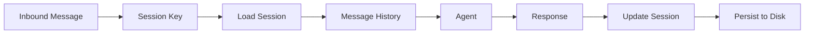
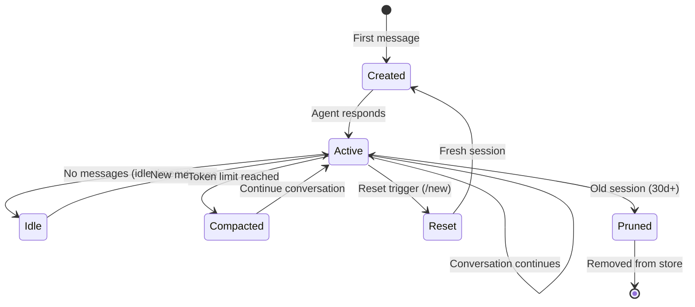

# Sessions

Sessions provide conversation context isolation for each sender. Every DM, group chat, or thread gets its own session with persistent message history, model settings, and conversation state.

## What is a Session?

A session is a conversation context that includes:
- **Message History**: Full conversation transcript
- **Agent State**: Current model, settings, and configuration
- **Metadata**: Sender info, channel, timestamps
- **Delivery Context**: Last known route for replies
- **Usage Tracking**: Token counts and model information



## Session Keys

### Session Key Format

Each session has a unique key that identifies the conversation:

```
agent:{agentId}:{channel}:{accountId}:{chatType}:{peerId}
```

**Examples**:
```
agent:main:telegram:default:direct:123456789
agent:main:discord:default:group:987654321
agent:coding:slack:work:channel:C01234567
agent:main:whatsapp:default:group:120363012345678901@g.us
```

**Location**: src/routing/session-key.ts:142

### Session Key Components

| Component | Description | Example |
|-----------|-------------|----------|
| `agent` | Prefix (always "agent") | `agent` |
| `agentId` | Agent identifier | `main`, `coding` |
| `channel` | Messaging platform | `telegram`, `discord` |
| `accountId` | Channel account ID | `default`, `work` |
| `chatType` | Chat type | `direct`, `group`, `channel` |
| `peerId` | User/group identifier | `123456789` |

**Location**: src/routing/session-key.ts:90

### DM Session Scoping

Direct messages can share or separate sessions:

```json
{
  "session": {
    "dmScope": "main"
  }
}
```

**DM Scope Options**:
- `main`: All DMs share one session (default)
- `per-peer`: Separate session per sender
- `per-channel-peer`: Separate per sender+channel
- `per-account-channel-peer`: Separate per account+channel+sender

**Example with `main`** (shared):
```
agent:main:main
```

**Example with `per-peer`**:
```
agent:main:direct:alice
agent:main:direct:bob
```

**Example with `per-channel-peer`**:
```
agent:main:telegram:direct:alice
agent:main:discord:direct:alice
```

**Location**: src/routing/session-key.ts:149, src/config/types.base.ts:6

### Identity Links

Link identities across platforms to share sessions:

```json
{
  "session": {
    "dmScope": "per-peer",
    "identityLinks": {
      "alice": [
        "telegram:123456789",
        "discord:987654321",
        "+15551234567"
      ]
    }
  }
}
```

Now Alice's messages from Telegram, Discord, and WhatsApp all use:
```
agent:main:direct:alice
```

**Location**: src/routing/session-key.ts:190, src/config/types.base.ts:92

## Session Storage

### Storage Location

Sessions are stored as JSONL files:

```
~/.openclaw/sessions/
├── agent:main:telegram:default:direct:123456789.jsonl
├── agent:main:discord:default:group:987654321.jsonl
├── agent:coding:slack:work:channel:C01234567.jsonl
└── sessions.json
```

**Location**: src/config/sessions/paths.ts:1

### Session Transcript Format

Each `.jsonl` file contains one message per line:

```jsonl
{"timestamp":"2026-02-19T10:00:00.000Z","message":{"role":"user","content":"Hello!"}}
{"timestamp":"2026-02-19T10:00:05.000Z","message":{"role":"assistant","content":"Hi! How can I help?"}}
{"timestamp":"2026-02-19T10:01:00.000Z","message":{"role":"user","content":"What's the weather?"}}
{"timestamp":"2026-02-19T10:01:03.000Z","message":{"role":"assistant","content":"I'll check for you..."}}
```

**Line Format**:
```typescript
type TranscriptLine = {
  timestamp: string;
  message: {
    role: "user" | "assistant" | "system";
    content: string | Array<ContentBlock>;
  };
};
```

**Location**: src/config/sessions/transcript.ts:1, src/gateway/session-utils.fs.ts:69

### Session Metadata

Session metadata is stored in `sessions.json`:

```json
{
  "agent:main:telegram:default:direct:123456789": {
    "sessionId": "abc123-def456",
    "updatedAt": 1708344000000,
    "label": "Alice (Telegram)",
    "channel": "telegram",
    "chatType": "direct",
    "model": "anthropic/claude-opus-4-6",
    "inputTokens": 1234,
    "outputTokens": 567,
    "totalTokens": 1801,
    "compactionCount": 2,
    "lastChannel": "telegram",
    "lastTo": "123456789"
  }
}
```

**Key Fields**:
- `sessionId`: Unique UUID for this session
- `updatedAt`: Last message timestamp (ms)
- `label`: Display name for UI
- `channel`: Originating channel
- `chatType`: `direct`, `group`, `channel`, or `thread`
- `model`: Current AI model
- `compactionCount`: Number of compactions performed
- `lastChannel`, `lastTo`: Delivery context for replies

**Location**: src/config/sessions/types.ts:25, src/config/sessions/store.ts:1

## Session Lifecycle



### Session Creation

Sessions are created automatically on first message:

1. **User sends first message**
2. **Router generates session key** based on agent, channel, and sender
3. **Gateway creates session** with empty history
4. **Agent processes message** and generates response
5. **Session saved to disk** with metadata

**Location**: src/config/sessions/store.ts:1

### Session Reset

Sessions can be reset manually or automatically:

**Manual Reset**:
```
User: /new
Bot: [Session reset. Starting fresh conversation.]
```

**Configuration**:
```json
{
  "session": {
    "resetTriggers": ["/new", "/reset"],
    "reset": {
      "mode": "daily",
      "atHour": 0
    },
    "resetByType": {
      "direct": {
        "mode": "idle",
        "idleMinutes": 60
      },
      "group": {
        "mode": "daily",
        "atHour": 3
      }
    }
  }
}
```

**Reset Modes**:
- `daily`: Reset at specific hour each day
- `idle`: Reset after N minutes of inactivity

**Location**: src/config/sessions/reset.ts:1, src/config/types.base.ts:71

### Session Compaction

When a session grows too large, OpenClaw compacts it:

1. **Trigger**: Session exceeds token limit (e.g., 100k tokens)
2. **Compaction LLM**: Summarizes conversation history
3. **Summary Injected**: Replaces old messages with summary
4. **Recent Messages Kept**: Last N messages preserved
5. **Transcript Updated**: Compaction event logged

**Compaction Entry**:
```jsonl
{"type":"compaction","timestamp":"2026-02-19T12:00:00.000Z","summary":"Discussed weather, traffic, and dinner plans."}
```

**Location**: src/agents/pi-embedded-subscribe.handlers.compaction.ts:1

<Info>
Compaction preserves conversation continuity while reducing token usage and cost.
</Info>

## Session Configuration

### Basic Settings

```json
{
  "session": {
    "scope": "per-sender",
    "dmScope": "main",
    "idleMinutes": 60,
    "store": "~/.openclaw/sessions"
  }
}
```

**Location**: src/config/types.base.ts:87

### Reset Configuration

```json
{
  "session": {
    "resetTriggers": ["/new", "/reset", "/fresh"],
    "reset": {
      "mode": "idle",
      "idleMinutes": 120
    },
    "resetByType": {
      "direct": {
        "mode": "idle",
        "idleMinutes": 60
      },
      "group": {
        "mode": "daily",
        "atHour": 3
      },
      "thread": {
        "mode": "idle",
        "idleMinutes": 30
      }
    },
    "resetByChannel": {
      "discord": {
        "mode": "idle",
        "idleMinutes": 10080
      }
    }
  }
}
```

**Location**: src/config/types.base.ts:71

### Maintenance Configuration

```json
{
  "session": {
    "maintenance": {
      "mode": "enforce",
      "pruneAfter": "30d",
      "maxEntries": 500,
      "rotateBytes": "10mb"
    }
  }
}
```

**Maintenance Options**:
- `mode`: `warn` (log only) or `enforce` (apply limits)
- `pruneAfter`: Remove sessions older than duration (e.g., `30d`, `12h`)
- `maxEntries`: Maximum session count in `sessions.json`
- `rotateBytes`: Rotate `sessions.json` when size exceeds limit

**Location**: src/config/types.base.ts:113

## Session Pruning

### Automatic Pruning

Old sessions are pruned automatically:

**Default Behavior**:
- Sessions older than **30 days** are warned
- Mode defaults to `warn` (no automatic deletion)

**Enable Enforcement**:
```json
{
  "session": {
    "maintenance": {
      "mode": "enforce",
      "pruneAfter": "30d"
    }
  }
}
```

**Location**: src/config/sessions/store.ts:1

### Manual Pruning

```bash
# List old sessions
oclaw sessions list --older-than 30d

# Delete old sessions
oclaw sessions prune --older-than 30d

# Delete specific session
oclaw sessions delete agent:main:telegram:default:direct:123456789
```

**Location**: src/commands/sessions.ts:1

### Archival

Before pruning, sessions are archived:

```
~/.openclaw/sessions/archive/
├── 2026-02-19T12-00-00-agent-main-telegram-default-direct-123456789.jsonl.gz
└── archive.json
```

**Location**: src/gateway/session-utils.fs.ts:1

## Session Management

### List Sessions

```bash
# List all sessions
oclaw sessions list

# List active sessions (messaged in last 24h)
oclaw sessions list --active

# List by channel
oclaw sessions list --channel telegram

# List by agent
oclaw sessions list --agent coding
```

**Output**:
```
SESSION KEY                                      AGENT   CHANNEL   LAST MESSAGE    TOKENS
agent:main:telegram:default:direct:123456789     main    telegram  2 minutes ago   1.8k
agent:main:discord:default:group:987654321       main    discord   5 minutes ago   12.3k
agent:coding:slack:work:channel:C01234567        coding  slack     1 hour ago      45.6k
```

**Location**: src/commands/sessions.ts:1

### Inspect Session

```bash
# Show session metadata
oclaw sessions show agent:main:telegram:default:direct:123456789

# Show full transcript
oclaw sessions show agent:main:telegram:default:direct:123456789 --transcript

# Export session to file
oclaw sessions export agent:main:telegram:default:direct:123456789 > session.jsonl
```

**Location**: src/commands/sessions.ts:1

### Reset Session

```bash
# Reset specific session
oclaw sessions reset agent:main:telegram:default:direct:123456789

# Reset all sessions for a channel
oclaw sessions reset --channel telegram

# Reset all sessions for an agent
oclaw sessions reset --agent coding
```

**Location**: src/commands/sessions.ts:1

## Session Persistence

### Write Lock

Session writes are protected by a lock to prevent corruption:

```typescript
await acquireSessionWriteLock(sessionKey, async () => {
  // Write session data
  await fs.writeFile(sessionPath, data);
});
```

**Location**: src/agents/session-write-lock.ts:4

### Atomic Writes

Session updates use atomic write-then-rename:

1. Write to `.tmp` file
2. Verify write succeeded
3. Rename to final path

**Location**: src/config/sessions/store.ts:1

### Cache Management

Session metadata is cached in memory:

- **TTL**: 45 seconds (default)
- **Invalidation**: On write
- **Size Limit**: 5000 entries

**Location**: src/config/sessions/store.ts:39

## Advanced Features

### Thread Sessions

Threaded conversations create sub-sessions:

```
Parent: agent:main:discord:default:channel:987654321
Thread: agent:main:discord:default:channel:987654321:thread:1234567890
```

**Location**: src/routing/session-key.ts:254

### Group History Keys

Group chats use a shared history key:

```typescript
const historyKey = buildGroupHistoryKey({
  channel: "telegram",
  accountId: "default",
  peerKind: "group",
  peerId: "-1001234567890"
});
// => "telegram:default:group:-1001234567890"
```

**Location**: src/routing/session-key.ts:236

### Session Send Policy

Control which sessions can send outbound messages:

```json
{
  "session": {
    "sendPolicy": {
      "default": "deny",
      "rules": [
        {
          "action": "allow",
          "match": {
            "channel": "telegram",
            "chatType": "direct"
          }
        },
        {
          "action": "allow",
          "match": {
            "keyPrefix": "agent:main:discord"
          }
        }
      ]
    }
  }
}
```

**Location**: src/config/types.base.ts:50

## Troubleshooting

### Session Not Loading

```bash
# Check if session exists
oclaw sessions list | grep <session-key>

# Verify session file
ls -la ~/.openclaw/sessions/

# Check session metadata
oclaw sessions show <session-key>
```

### Session Corruption

```bash
# Validate session transcript
oclaw sessions validate <session-key>

# Restore from backup
cp ~/.openclaw/sessions/archive/<backup>.jsonl.gz ~/.openclaw/sessions/
gzip -d ~/.openclaw/sessions/<backup>.jsonl.gz
```

### High Token Usage

```bash
# List sessions by token count
oclaw sessions list --sort-by tokens

# Force compaction
oclaw sessions compact <session-key>

# Reset high-token sessions
oclaw sessions reset --min-tokens 50000
```

<Warning>
Session files contain full conversation history. Back up regularly and secure access.
</Warning>

## Next Steps

<CardGroup cols={2}>
  <Card title="Message Routing" icon="route" href="/concepts/routing">
    Configure multi-agent routing rules
  </Card>
  <Card title="Agent Configuration" icon="robot" href="/concepts/agents">
    Customize agent behavior and models
  </Card>
  <Card title="Channel Setup" icon="message" href="/concepts/channels">
    Connect messaging platforms
  </Card>
  <Card title="Session Commands" icon="terminal" href="/cli/sessions">
    CLI reference for session management
  </Card>
</CardGroup>