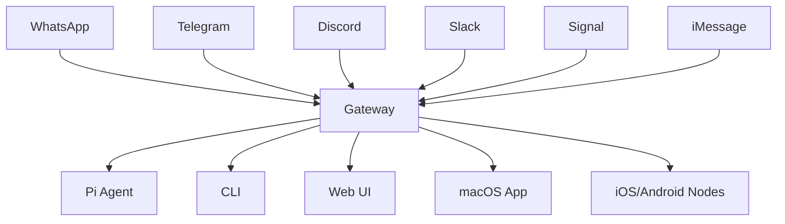

# Welcome to OpenClaw

OpenClaw is a **personal AI assistant** you run on your own devices. It acts as a central gateway that connects AI agents to all your messaging platforms—WhatsApp, Telegram, Discord, Slack, Signal, iMessage, and more.

## What is OpenClaw?

OpenClaw provides a **local-first Gateway** that serves as a single control plane for:

- **Multi-channel messaging**: Connect to WhatsApp, Telegram, Discord, Slack, Signal, iMessage, Google Chat, Microsoft Teams, and more
- **AI agent integration**: Built-in Pi agent runtime with RPC mode, tool streaming, and block streaming
- **Session management**: Per-sender sessions with group isolation and activation modes
- **Security by default**: DM pairing, allowlists, and sandbox isolation for group chats
- **Multi-platform support**: macOS menu bar app, iOS/Android nodes, and web control UI

If you want a personal, single-user assistant that feels local, fast, and always-on, this is it.

## Key Features

<CardGroup cols={2}>
  <Card title="Multi-Channel Inbox" icon="messages" href="/channels/overview">
    Connect to WhatsApp, Telegram, Discord, Slack, Signal, iMessage, and more from a single gateway
  </Card>
  <Card title="Local-First Gateway" icon="server" href="/concepts/gateway">
    Self-hosted control plane for sessions, channels, tools, and events
  </Card>
  <Card title="AI Agent Runtime" icon="robot" href="/concepts/agents">
    Built-in Pi agent with tool streaming, workspace isolation, and multi-agent routing
  </Card>
  <Card title="Platform Apps" icon="mobile" href="/platforms/macos">
    macOS menu bar app, iOS/Android nodes, and web control UI
  </Card>
</CardGroup>

## How It Works

The Gateway runs as a WebSocket server (default port 18789) on your local machine or VPS. All messaging channels connect through the Gateway, which routes messages to the appropriate AI agent based on your configuration.

## Quick Links

<CardGroup cols={3}>
  <Card title="Quickstart" icon="rocket" href="/quickstart">
    Get up and running in under 5 minutes
  </Card>
  <Card title="Installation" icon="download" href="/installation">
    Detailed installation instructions
  </Card>
  <Card title="Configuration" icon="gear" href="/configuration">
    Configure your gateway and channels
  </Card>
</CardGroup>

## Architecture Overview

OpenClaw's architecture consists of:

1. **Gateway**: WebSocket control plane at `ws://127.0.0.1:18789`
2. **Channels**: Messaging platform integrations (WhatsApp, Telegram, etc.)
3. **Agents**: AI agent runtime with Pi agent support
4. **Sessions**: Per-sender session management with group isolation
5. **Tools**: Browser control, canvas, nodes, cron jobs, and automation
6. **Platform Apps**: macOS app, iOS/Android nodes, web UI

Learn more about the [architecture](/concepts/architecture) and [core concepts](/concepts/gateway).

## Use Cases

- **Personal AI Assistant**: Chat with AI on your preferred messaging platform
- **Multi-Agent Systems**: Route different channels or groups to specialized agents
- **Automation**: Set up cron jobs, webhooks, and automated workflows
- **Team Collaboration**: Shared AI assistant for Discord/Slack teams with role-based access
- **Voice Interaction**: Voice Wake and Talk Mode on macOS/iOS/Android
- **Visual Workspace**: Live Canvas for agent-driven visual interactions

## Security & Privacy

OpenClaw is **self-hosted** and **local-first**:

- All data stays on your devices
- Default DM pairing prevents unauthorized access
- Allowlists control who can interact with your assistant
- Sandbox isolation for group chats
- Optional password/token authentication for web access

Learn more about [security best practices](/guides/security).

## Next Steps

<Steps>
  <Step title="Install OpenClaw">
    Follow the [installation guide](/installation) to set up OpenClaw on your system
  </Step>
  <Step title="Run the Onboarding Wizard">
    Use `openclaw onboard --install-daemon` to configure your gateway and channels
  </Step>
  <Step title="Connect Channels">
    Set up your preferred messaging channels (WhatsApp, Telegram, Discord, etc.)
  </Step>
  <Step title="Start Chatting">
    Send your first message and experience your personal AI assistant
  </Step>
</Steps>

## Community & Support

- **GitHub**: [openclaw/openclaw](https://github.com/openclaw/openclaw)
- **Discord**: [Join our community](https://discord.gg/clawd)
- **Documentation**: [docs.openclaw.ai](https://docs.openclaw.ai)
- **Website**: [openclaw.ai](https://openclaw.ai)

OpenClaw is MIT licensed and built by the community. Contributions welcome!